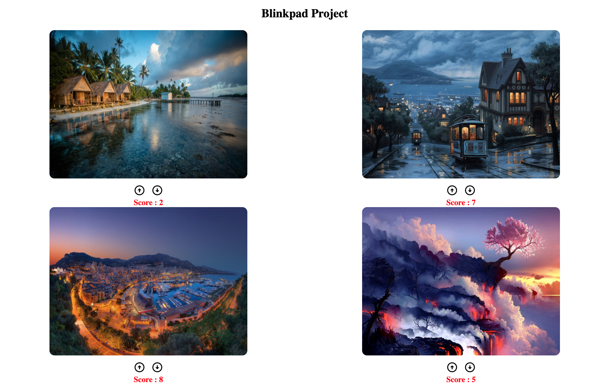

# imagescore
imagescore

## Tech Stack
#### BackEnd  : Flask
#### FrontEnd : Vue.js
#### Database : MongoDB

## Docker deployment steps
Backend

docker build -t divjotdhodydocker/imagecounter:v13 .

docker push divjotdhodydocker/imagecounter:v13

docker run -td -p 5000:5000 divjotdhodydocker/imagecounter:v13

Frontend

docker build -t divjotdhodydocker/frontimagecounter:v1 .

docker push divjotdhodydocker/frontimagecounter:v1

docker run -td -p 8080:8080 divjotdhodydocker/frontimagecounter:v1

